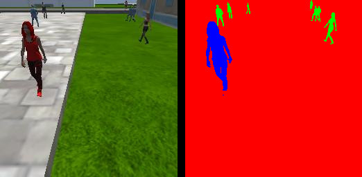
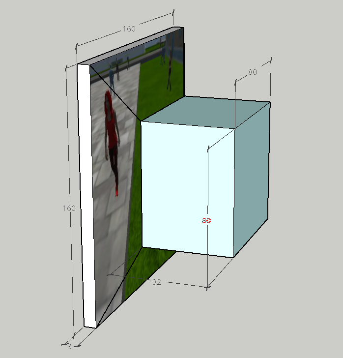
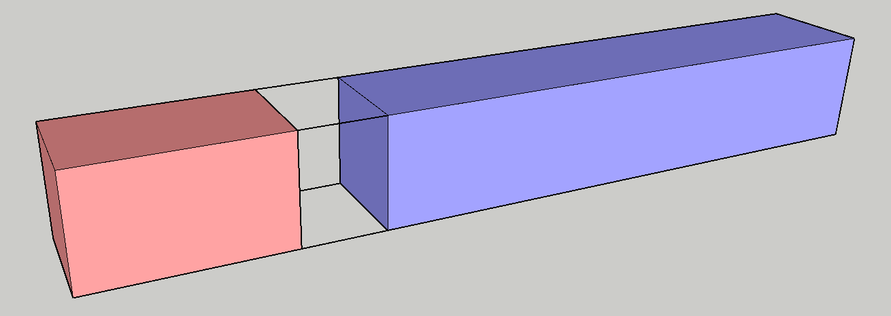
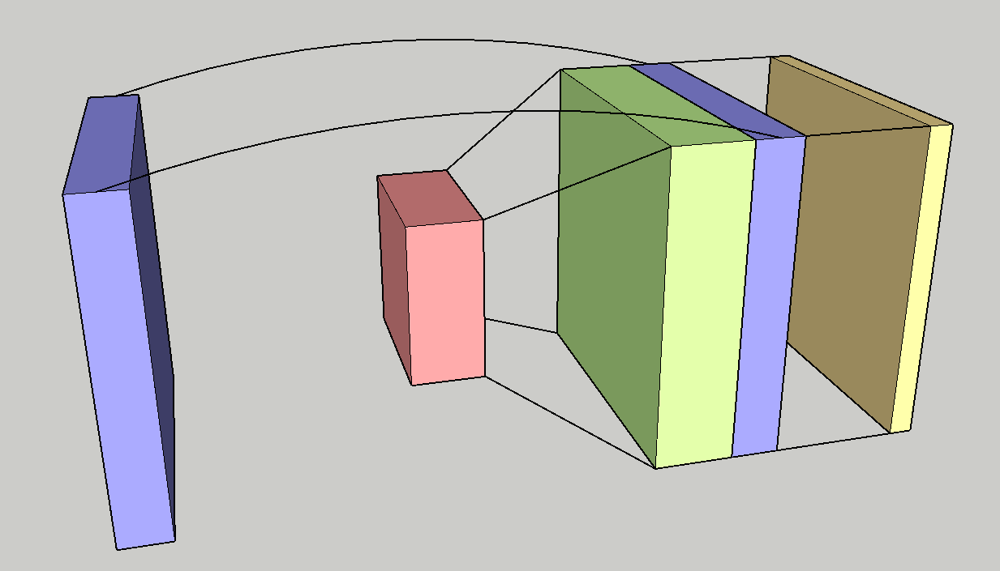
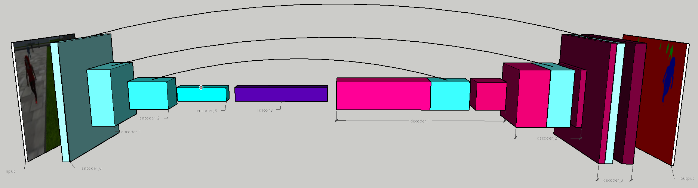
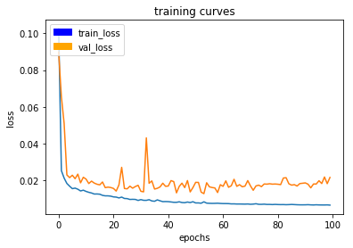
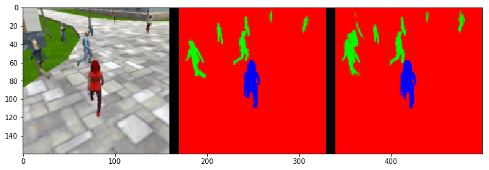
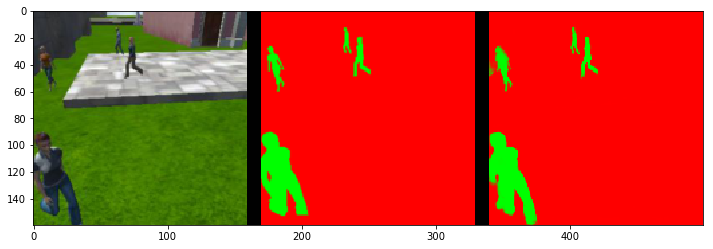
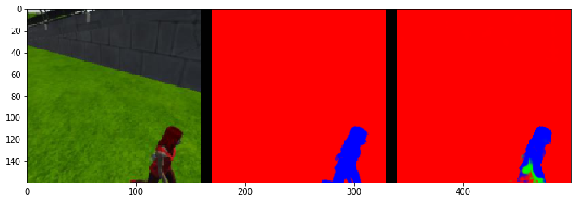

# Project 4: Follow me

This project aims at training a model to process the camera image of the gimbal camera of a quadcopter to identify the presence and the locations of background, people and a specific target person. Once the target person (hero) is detected in the image the drone is supposed to determine its location and follow the hero around.

The task at hand boils down to performing semantic image segmentation for the three desired classes (background, people, hero). In image segmentation we are trying to answer the question: "Which predefined class does each pixel of the image most likely belong to?" We want to detect objects and not only confirm or deny their presence, as it's the case in image classification, but rather determine their exact location and shape in the original input image.

For such a task the neural network architecture of a fully convolutional neural network (FCN) has shown to produce successfull semantic segmentation models. Therefore such an FCN was designed, trained and tested. The following sections will introduce the necessary components and concepts to build and train said model.

---

## Problem domain and data

Since the problem is considered a supervised learning task the provided simulation engine written in Unity was used to acquire labeled (segmented) training and validation data to train the network afterwards.

The following image shows a camera image of the quadcopter in the simulator and the corresponding segmentation map labeling background (red), people (green) and the hero (blue).

Using the simulator a dataset of 11700 training images and 2614 validation images were acquired for the different scenarios repeatedly in varying locations of the simulation environment:

* patrolling along a predefined path without explicitly seeing the hero
* patrolling over a crowded region that mainly intersects with the heroes path
* directly following the hero
* manually flying the quadcopter to capture the hero in the distance

One such data acquisition run can be seen at https://youtu.be/9hTfsF-sML8.

---

## Neural Network architecture

A fully convolutional network is comprised of encoder and decoder blocks to first extract salient features for the segmentation task and then produce the desired segmented image. Using the cascade of encoder blocks the network is supposed to generate an abstract representation of the content that is present in the input image. From this abstract understanding of the characteristics of regions in the image the decoder cascade should learn to perform the segmentation (i.e. pixelwise classification) task. These network blocks follow very interesting design principles laid out in the following sections.

# Encoder
The encoder block is basically a separable 2d convolution layer applying filter kernels creating feature maps followed by batch normalization to facilitate quicker training. Using the stride parameter the dimensionality is usually reduced with each encoder block, reducing also the number of trainable parameters and increasing the receptive field of the following layer. The encoder essentially looks at a patch of the image and extracts features that hold salient information for the segmentation task. 

### Separable 2d convolution
Convolution layers have proven to be a successfull tool at extracting information from inputs where local neighbourhoods of  neurons are known (or at least supposed) to be statistically dependent.   
!TODO explain sep 2d conv 

### Batch normalization
The technique of batch normalization in its essence does what every machine learning engineer is supposed to do as a data preprocessing step; it normalizes the data to have zero mean and unit variance. In constrast to the engineer, the normalization can be applied to any layer within the network where it then scales and offsets the activations for each batch being processed such that they have these desireable statistics. These properties make the optimization problem during training easier by producing more stable gradients which then allows for the usage of higher learning rates.

*This image shows an encoder block operating on the 160x160x3 input image extracting 32 feature maps (applying 3x3 kernels) using a stride of 2.*

# 1x1 convolution layer (reasoning layer)

In between the encoder and decoder section of the fully convolutional network sits a convolutional layer with kernel size 1 which acts as a "reasoning" layer just like a fully connected layer.
The main difference to a fully connected layer is that the 1x1 convolution enables the preservation of the location information.

In a fully connected layer each neuron is connected to every ouput neuron of the preceding layer which means that a neuron by design doesn't correspond to a specific spatial location of the input layer. This means that beyond this layer we would basically lose information about the location of determined features. 

The convolutional counterpart to the fully connected layer just applies a convolution with a 1x1 kernel for each feature map which means that there's a direct link between the spatial location of input and output. Since convolutions are used it's even computationally less expensive to train the parameters because weights are shared for each pixel. We essentially establish a location invariant filter map that acts like a per pixel fully connected layer.

Another big advantage is that the 1x1 convolutional layer doesn't alter its complexity and can be reused even if the spatial dimensions of the preceding layer change.

# Decoder
The decoder block first applies bilinear upsampling to the input layer to scale up the width and height dimensions of the input features by factor 2. 

If provided, the upscaled feature maps are then concatenated with skip connections from previous layers.

Using these concatenated layers one or several regular convolutional layers, or in this case separable 2d convolutions, are applied.

## Bilinear upsampling

The data provided by the encoder is spatially compressed from 160x160 input pixels down to lower dimensional abstract representation providing insights about the image contents. The ouput of the network however is supposed to have the same resolution as the original image, hence we have to expand the encoded information using some upsampling technique.

Bilinear upsampling is a simple interpolation technique that allows to directly map an input image to an output image twice its size. For example the information contained in a 2x2 image block is scattered to a 4x4 block using a predefined interpolation scheme.

This way each decoder block can increase the resolution of the preceding network layer by a factor of 2, which acts as a nice counterpart to the downsampling in the encoder blocks using a stride of 2.

An alternative method that has proven to yield reasonable results is to use transposed convolutional layers. They however have to be trained in order to produce a meaningful upsampling.

## Skip connections

The encoder has provided an abstract representation of the input image which helps at understanding the image content. Due to the spatial compression of the encoder blocks this data might however lack relevant details about the original patterns. 

At this point the network might for example have extracted the presence and location of a recognized object but using only this information the decoder block wouldn't be able to reconstruct where exactly the edges of a structure are situated. Therefore we provide the unencoded data from previous layers to the decoder by simply concatenating them (depthwise) with the resulting layers of the bilinear upsampling. This way the decoder can also use fine grained structural information to paint the intermediate and final segmentation images. 

## Convolutions
Using the upscaled encoded information and the higher resolution structural information provided by the skip connections the decoder can now apply convolutional filter kernels to learn how to paint the segmented image. Once again convolutions are the tool of choice to provide a location invariant, computationally feasible network architecture.

To make the encoder more expressive I chose to add two separable 2d convolutional layers. This increases the receptive field of the decoders output neurons, adds more trainable parameters at relatively low computational cost and what's even more important: it adds one more nonlinearity.

The image below depicts the architecture of a decoder block.
The red feature maps are bilinearly upsampled to the green feature maps. The blue features are optionally provided skip connection from previous network layers. The yellow block is the convolution result from the preceding concatenated layers applying filter kernels and making up the final ouput of the decoder block.

# Output 
The output of the network is supposed to provide a predicted probability distribution over all possible classes for each pixel in the original input image. 
Hence, the last decoder block is followed by a convolutional layer with one feature map for each class that should be represented in the segmentation task using a softmax activation function to basically perform pixelwise classification. Each pixel is then classified according to the most probable class and we end up with a semantically segmented image.  

# Architecture

The final architecture is then set up in the following way:
* input: 160x160x3 image
* encoder_0: 10 filters, stride 1 
* encoder_1: 32 filters, stride 2 
* encoder_2: 100 filters, stride 2 
* encoder_3: 200 filters, stride 2 
* encoded: 1x1 convolution 512 filters
* decoder_1: 200 filters, skip connections from encoder_2
* decoder_2: 100 filters, skip connections from encoder_1
* decoder_3: 32 filters, skip connections from encoder_0
* output: 1x1 convolution 3 filters, with softmax activation

*Final FCN architecture used for semantic image segmentation*

### Summary FCN for Semantic Segmentation
The encoder cascade (teal) performs a stepwise extraction of features from the input image. These features are used to generate an encoded abstract representation for image understanding in the middle of the network (purple). Using the encoded information combined with features from outlets of the encoder cascade the decoder (pink & teal) constructs a semantically segmented image as network output.

---

# Training

The model was trained on a GPU instance of the elastic cloud (EC2) provided by the amazon web services (AWS).
For the training of the network the following parameters were used:

parameter|value
-|-
epochs | 100
batchsize | 64
learning rate (epoch 0-3) | 0.01 
learning rate (epoch 3-10) | 0.001
learning rate (epoch 10-100) | 0.001 * 0.975^epoch 
steps (per epoch) | 200
validation steps (per epoch) | 50

The parameters were mostly determined experimentally by trying various configurations and sticking to what produced reasonable models. The arguments for the parameter choices are as follows:

* epochs: after 100 epochs learning plateaus and the model still doesn't overfit  
* batchsize: 64 yields a good gradient estimate for each learning step and results in manageable memory allocation on AWS servers
* learning rate: base learning rate = 0.001

    the learning rate is boosted for the first 3 epochs to quickly reach good model states

    beyond epoch #10 the learning rate is exponentially decayed to overcome plateauing and allow for the final improvements of the model

        def lr_schedule(epoch):
            if epoch < 3:
                lr = learning_rate * 10    # boost period 
            else:
                lr = learning_rate * np.power(0.975, epoch-10)
                lr = np.clip(lr, 1e-4, 1e-3)
            print('learning rate:{}'.format(lr))
            return lr

* steps per epoch: 200 such that within each epoch the entire training data set of 11700 samples is used; (steps * batchsize) = (200 * 64) = 12800 
* validation steps per epoch: 50 to ensure that the model is for sure evaluated on all 2614 validation samples; (validation steps * batchsize) = (50 * 64) = 3200

The training on the amazon web service with GPU capabilities took approximately 10 hours and yielded a reasonable model. The validation loss seems to cap out after 30 epochs already but since it didn't show signs of overfitting the training was continued up to a point where it hit a plateau.

---

# Results

The resulting model is largely able to perform the segmentation task as desired. The model parameters and config can be found in `data/weights/model_weights.h5` and `data/weights/config_model_weights.h5`

The following images show the input image, the correct segmentation and the model estimate for some of the provided validation samples.

# Scores
For the provided sample validation set the model achieves a satisfying final Intersection over Union (IoU) score of 0.5079. However the network seems to still have trouble detecting the hero in the distance. By looking at the missclassified false negative result regarding the detection of the hero it seems to be mainly a problem of low illumination that causes the model to mistake the hero for a regular person.

If the task would change to detecting and following other targets (such as animals or cars) it would be necessary to acquire new training data and retrain the model to perform this segmentation. Possibly one might even have to adapt the network architecture to allow for the detection of smaller targets which appear to be troublesome for the current setup already.

The final model can be seen in action here https://youtu.be/wWINhsZmoBs, used for the segmentation of the input image of the quadcopter that is supposed to search and follow the hero. We can observe that the quadcopter succesfully finds and follows the target.

